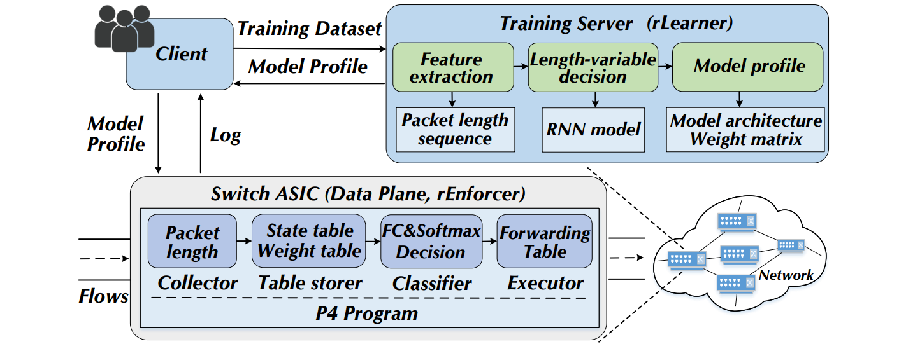
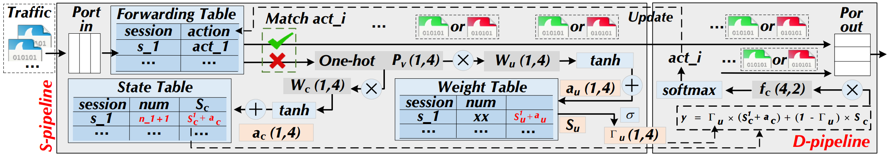
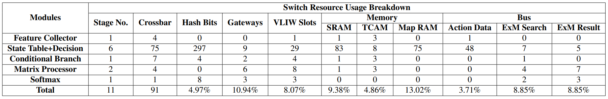

### RIDS: Towards Advanced Intrusion Detections via RNN Model and Programmable Switches Co-designed Approaches



## Introduction

RIDS is a hardware-friendly Recurrent Neural Network (RNN) model that is co-designed with programmable switches. It includes: (i) rLearner focuses on implementing the model inference process which only depends on bitwise operations or integer additions/subtractions; (ii) rEnforcer is the specially designed pipeline enforcing rLearner-generated models inside the switches. This anonymous repository displays the corresponding source code for model implementation. 

## Requirements

```bash
pip install scipy
pip install numpy
pip install pandas
pip install tqdm
pip install pyecharts
pip install joblib
pip install pickle
pip install torch
```

## Feature Extraction

The model architecture is stored in ./rLearner/models.py. 
```bash
python models.py
```

## Pipeline




## Programmable Switches

The P4 implementation is stored in ./rEnforcer/. 




### References
- [Mousika: Enable General In-Network Intelligence in Programmable Switches by Knowledge Distillation](https://ieeexplore.ieee.org/document/9796936/), Guorui Xie, Qing Li, Yutao Dong, Guanglin Duan, Yong Jiang, Jingpu Duan - INFOCOM 2022
